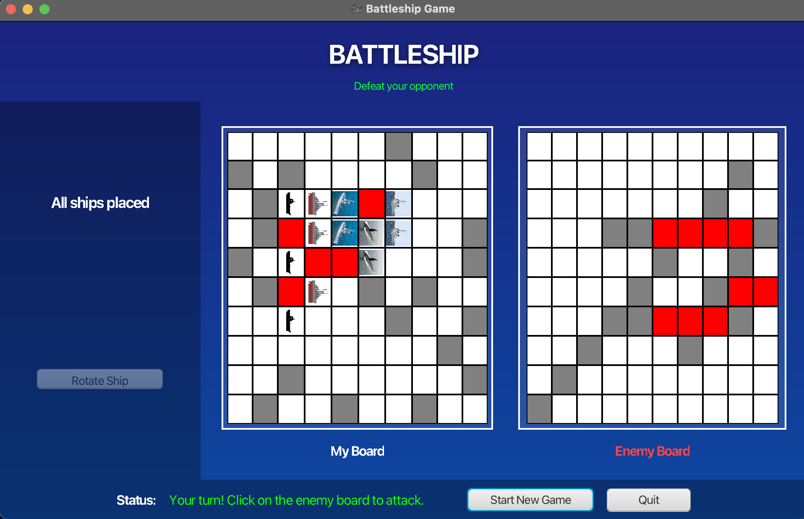
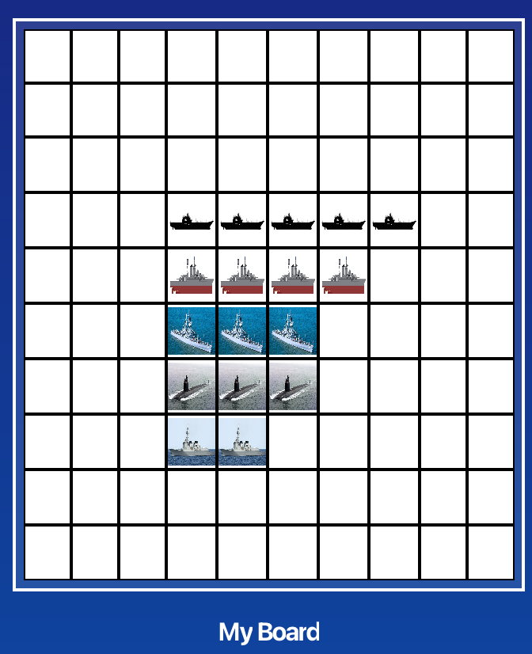
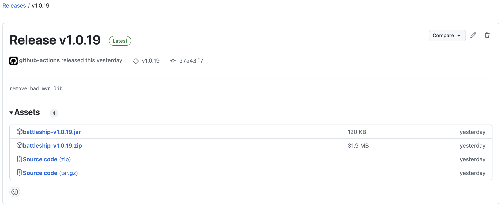

### TODO
- [x] random AI
- [x] refactor
- [x] smart AI
- [x] unit test
- [x] improve UI
- [x] refactor 2.0
- [x] CI/CD (create build on commits to master; if tests pass aussi)
- [x] local builds
- [] smart AI 2.0
- [x] CI/CD (create release for all platforms)
- [x] add all 5 ships
- [x] update README


# Javafx Battleship Game (MVC)
Battleship is a strategy guessing game for two players. It is 
played on ruled grids where each player marks their fleet of ships.
The locations of these fleets remain hidden from the other player. 
Players take turns attacking other player’s ships and the aim is to 
be the first one to destroy their opponents fleet to WIN!





## Game rules
 - **Objective**: Be the first to sink all of your opponents ships by correctly guessing 
their locations on a hidden grid
 - **Game Setup**: Each player has two 10×10 grids:
   - **Primary Grid**(My Board): For placing your ships. 
   - **Tracking Grid**(Enemy Board): to keep track of your shots at the opponents board.
   - *Standard fleet*: Ships are placed horizontally or vertically and they cannot overlap. 
     - >Carrier – 5 cells
     - >Battleship – 4 cells
     - >Cruiser – 3 cells
     - >Submarine – 3 cells
     - >Destroyer – 2 cells 
 - **Gameplay**: Players alternate turns and have only one play per turn.

**The first player to sink their opponents fleet, WINS!**

## How to Run

### Running in an IDE
1. Open the project in IntelliJ IDEA or in your favorite IDE/text editor
2. Wait for Maven to download dependencies
3. Find `HelloApplication.java` in the root folder
4. Right-click and select "Run 'HelloApplication.main()'"

**PS:** if you are using another IDE this should also be possible, if not make sure you 
have the right java and JDK versions(`pom.xml`)

### Running from Command Line
1. CD in the project root
    ```bash
       cd path/to/batlleship
    ```
2. Build the project:
   ```bash
   mvn jaxafx:run
   ```

### Generating Runtime Image (macOS)
1. CD in the project root
    ```bash
       cd path/to/batlleship
    ```
2. Build the runtime image:
   ```bash
   mvn clean javafx:jlink
   ```
3. The runtime image will be created in `target/battleship.zip`
4. Extract the zip file 
5. Run the application:
   ```bash
   ./target/battleship/bin/battleship
   ```

**PS:** if you are using another OS the zip will be created
but the command to run the binary might be different.

---

## Overview

## CI/CD pipeline
Using GitHub Actions I was able to automate some processes like running test against 
any push or pull request to master. This makes sure all test pass and nothing did not break.
I also made another workflow that builds the project as a portable application that uses
an embedded Java runtime. For now this only creates a `batlleship.zip` file for linux. A future
improvement I would be to make one for MacOS and Windows OS too.


## Game modes
There are two game modes implemented, a solo game mode 
with a random AI opponent and one with a smart AI opponent.
> random AI places his ships randoms and randomly attacks 
too while the smart Ai uses strategies discussed below

### Smart AI Strategy

The Smart AI uses strategies found in these articles 
to optimize winning and prevent easy defeats
[Wiki How](https://www.wikihow.com/Win-at-Battleship) and
[The Spruce Crafts](https://www.thesprucecrafts.com/how-to-win-at-battleship-411068)

These include:

**Checkerboard Pattern Targeting**: The AI initially fires in a checkerboard pattern 
to maximize coverage while minimizing redundant shots.

**Hunt and Target Mode**: After a successful hit, the AI switches to a focused 
mode, targeting adjacent cells to sink the ship efficiently.

**Ship Size Consideration**: The AI optimizes guesses based on remaining un-sunk 
ships, targeting spaces large enough to fit them.

## Choices
## Game Model
- Cell class to represent individual cells and their current state
- Ship class to represent individual ships
- Board(Player Game Board) class to manage the game grid and moves
- Player interface for both human and AI players

## Design Patterns Used

### MVC (Model View Controller)
Separating the game into Model (game state), View (JavaFX UI), and 
Controller (game flow) promotes a clean architectural design by 
following the Model-View-Controller (MVC) pattern. The Model manages 
the core data and rules of the game, ensuring that the state remains consistent 
regardless of how it's displayed or interacted with. The View, implemented 
using JavaFX, is responsible for presenting the game to the user. The Controller handles 
user input and orchestrates the game's progression by acting as the intermediary 
between the Model and the View. This separation of concerns makes the 
codebase easier to maintain, test, and extend.

### Strategy Pattern
This pattern is ideal for handling different player behaviors, by encapsulating
each player's decision-making logic into separate strategy classes. 
Instead of hardcoding the logic for random or smart AI moves directly into the game 
flow, the game delegates the move decision to a `AIStrategy` interface with a common method 
like `makeMove(PlayerGameBoard board)` and `placeShips(PlayerGameBoard board)`.  
This approach enhances flexibility and scalability as new player types like a smarter AI  
 can be added without modifying existing code and breaking anything.

### Factory Pattern
For creating different types of ships
implementing the Factory Pattern by using the ShipType enum to instantiate ships. 
The Factory Pattern is all about encapsulating object creation logic in a single 
place, making it easier to manage and extend. I can easily add new ship types and sizes
and easily change old ones too.

I am leveraging enum constants as factories, which is a clean and extensible approach.

## javafx vs swing
Swing is also used to make GUIs in Java but more programmatically, while javafx offers\
both features. Also, I had to use JavaFx per instructions

### FXGL vs SceneBuilder
I choose JavaFx Scene Builder over **FXGL** a dedicated game library because it 
provided me with a simple and efficient way to design the user interface using JavaFX. 
It also had a better learning curve. It has a drag-and-drop functionality makes
it easy to create and manage UI components without complex coding, which is 
ideal for the straightforward interface required by this project.


## Future Features and Improvements
1. Multiplayer Lan
2. TestFX for UI and integration testing
3. Creating Native Installers for Mac, Windows and Linux using
   https://akman.github.io/jpackage-maven-plugin/
4. Animations


## Extra
### JavaFx Application Lifecycle Methods
>start() − The entry point method where the JavaFX graphics code is to be written.

> stop() − An empty method which can be overridden, here you can write the 
logic to stop the application.

> init() − An empty method which can be overridden, but you cannot create a 
stage or scene in this method.


## Project Structure
```
BattleshipGame/
├── src/
│   └── main/
│       ├── java/
│       │   └── com/sj/batlleship/batlleship/
│       │       ├── HelloApplication.java
│       │       ├── controllers/
│       │       │   ├── GameController.java
│       │       │   └── WelcomeController.java
│       │       ├── models/
│       │       │   ├── GameBoard.java
│       │       │   ├── Cell.java
│       │       │   ├── Ship.java
│       │       │   ├── Player.java
│       │       │   ├── HumanPlayer.java
│       │       │   └── ComputerPlayer.java
│       │       ├── strategies/
|       |       |   |── AIStrategy.java
│       │       │   ├── RandomStrategy.java
│       │       │   └── SmartStrategy.java
│       │       ├── enums/
│       │       │   ├── Orientation.java
│       │       │   ├── CellState.java
│       │       │   └── GameState.java
│       │       └── constants/
│       │           └── GameConstants.java
│       └── resources/
│           └── com/sj/batlleship/batlleship/
│               ├── views/
│               │   ├── game-scene.fxml
│               │   └── welcome.fxml
│               ├── images/
│               │   ├── carrier.png
│               │   ├── battleship.png
│               │   ├── cruiser.png
│               │   ├── submarine.png
│               │   └── destroyer.png
│               └── icon/
│                   └── ship.png
└── README.md
```


---


create .jar
`mvn clean package -DskipTests` then `java -jar battleshipv.jar`

> `mvn javafx:jlink` to get zip
>
mvn clean javafx:jlink jpackage:jpackage
creates
> target/dist/Battleship-1.0.0.dmg (macOS)
> target/dist/Battleship-1.0.0.msi (Windows)
> target/dist/Battleship-1.0.0.deb (Linux)

TL;DR
Run and develop → javafx:run

Package self-contained runtime → jlink:jlink

Create native installer → jpackage:jpackage

<details close>
  <summary>TASK</summary>
  World!
</details>